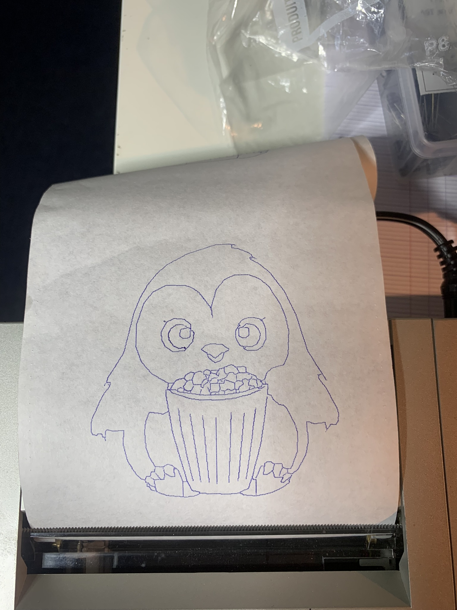
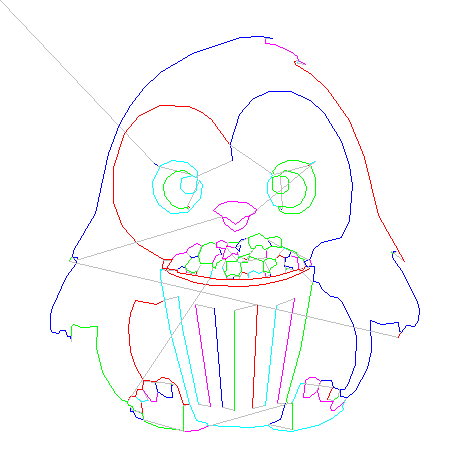

# PloTTY : draw stuff with your vintage plotter

(Note: This is a work in progress)

PloTTY is a python linux command line that transforms images into traces, suitable for beeing drawn on a vintage Casio PB-700, with its FA-10 pen plotter.

Here is a typical example of the result



Read more to get more detail of the process!

First, the source image, courtersy midjourney:


The source is then resized and converted to black and white, giving:


The large black areas need to be removed, so an erosion map is computed:


And removed from the orginal image, leading to:


This eroded picture contains lines, that we can convert to single pixels, giving:


This is still a pixel image, but it can be traced, giving the following segments:


Segments are ordered and flipped to minimize the travel of the plotter head:



And, drawing the image would give the following result:


The image is fundamentally a lists of coordinates, mainly:

```
[[[30.8, 62.4], [31.0, 62.4]],
 [[32.2, 62.4], [31.2, 62.2], [31.2, 61.0], [30.8, 61.0], [30.8, 60.0], [30.4, 60.0], [30.8, 59.2], [31.4, 60.8], [33.2, 62.2], [32.2, 62.6]],
 [[33.6, 63.0], [33.2, 63.0], [33.2, 62.4], [33.8, 62.4]],
 [[34.6, 62.8], [33.8, 62.6], [33.8, 63.2], [37.4, 62.6], [39.4, 60.8], [39.6, 59.6], [40.2, 59.2], [40.2, 55.8], [39.0, 53.6], [38.0, 53.4], [37.0, 52.4], [34.0, 52.4], [33.2, 52.8], [31.0, 55.2], [30.4, 57.4], [30.8, 59.0], [30.4, 58.8]],
 [[38.4, 59.8], [36.8, 59.8], [36.2, 59.2], [36.0, 57.6], [36.6, 56.8], [38.8, 56.8], [39.2, 59.2]],
```
*a little more than a hundred lines skipped*
``` 
 [[64.4, 18.8], [64.0, 18.2], [63.6, 18.8]],
 [[63.8, 18.0], [63.4, 17.0]],
 [[79.6, 27.6], [79.6, 27.8]],
 [[14.8, 43.2]],
 [[13.8, 43.2], [13.8, 42.8]]]
```

Those coordinates can then be turned into a basic program for the PB-700:

```
1LPRINT CHR$(28);CHR$(37):LPRINT"O0,-96"
2LPRINT"D30.8,62.4,31.0,62.4"
3LPRINT"D32.2,62.4,31.2,62.2,31.2,61.0,30.8,61.0,30.8,60.0,30.4,60.0"
4LPRINT"D30.4,60.0,30.8,59.2,31.4,60.8,33.2,62.2,32.2,62.6"
5LPRINT"D33.6,63.0,33.2,63.0,33.2,62.4,33.8,62.4"
6LPRINT"D34.6,62.8,33.8,62.6,33.8,63.2,37.4,62.6,39.4,60.8,39.6,59.6"
7LPRINT"D39.6,59.6,40.2,59.2,40.2,55.8,39.0,53.6,38.0,53.4,37.0,52.4"
8LPRINT"D37.0,52.4,34.0,52.4,33.2,52.8,31.0,55.2,30.4,57.4,30.8,59.0"
9LPRINT"D30.8,59.0,30.4,58.8"
10LPRINT"D38.4,59.8,36.8,59.8,36.2,59.2,36.0,57.6,36.6,56.8,38.8,56.8"
```
*and a lot of lines, until*
```
155LPRINT"D79.6,27.6,79.6,27.8"
156LPRINT"D13.8,43.2,13.8,42.8"
999LPRINT"M0,-20"
```

Which, in turn, can be turned into a wav file using the casutil software and uploaded on the real machine (only 10 minutes :-))

The PB-700 is then able to draw our nice penguin:


Click below to see a video of a PB-700 printing the real penguin!

[](https://youtu.be/iS6pO1wz-kc)


The tracing code is in ``trace.py`` and outputs the path in json. The basic generation in ``json2basic.py``, and take the json in input. There are example source images and results in the ``image`` subdirectory. You can use casutil to generate a wav file for consumption of you PB-700/FA-10!
