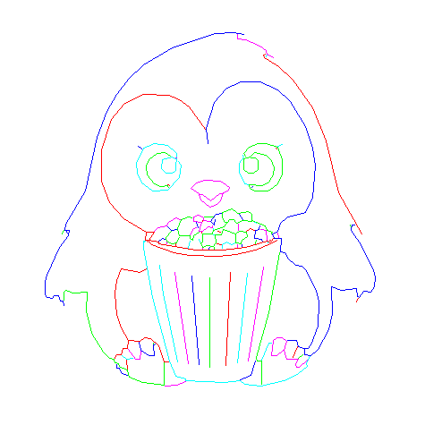

# casdraw

CasDraw is a python linux command line that transforms images into traces, suitable for beeing drawn on a vintage Casio PB-700, with its FA-10 pen plotter.

Here is the source, image, courtersy midjourney:


The source is then resized and converted to black and white, giving:


The large black areas need to be removed, so an erosion map is computed:


And removed from the orginal image, leading to:


This eroded picture contains lines, that we can convert to single pixels, giving:


This is still a pixel image, but it can be traced, giving the following segments:



Segments are ordered and flipped to minimize the travel of the poltter head:


And, drawing the image would give the following result:


The image is fundamentally a lists of coordinates, mainly:

```
[[[30.8, 62.4], [31.0, 62.4]], [[32.2, 62.4], [31.2, 62.2], [31.2, 61.0], [30.8, 61.0], [30.8, 60.0], [30.4, 60.0], [30.8, 59.2], [31.4, 60.8], [33.2, 62.2], [32.2, 62.6]], [[33.6, 63.0], [33.2, 63.0], [33.2, 62.4], [33.8, 62.4]], [[34.6, 62.8], [33.8, 62.6], [33.8, 63.2], [37.4, 62.6], [39.4, 60.8], [39.6, 59.6], [40.2, 59.2], [40.2, 55.8], [39.0, 53.6], [38.0, 53.4], [37.0, 52.4], [34.0, 52.4], [33.2, 52.8], [31.0, 55.2], [30.4, 57.4], [30.8, 59.0], [30.4, 58.8]], [[38.4, 59.8], [36.8, 59.8], [36.2, 59.2], [36.0, 57.6], [36.6, 56.8], [38.8, 56.8], [39.2, 59.2]], [[39.6, 59.4], [38.8, 59.6], [37.4, 61.0], [35.6, 61.2], [34.0, 60.4], [32.4, 58.0], [32.6, 56.0], [34.2, 54.0], [35.6, 53.4], [37.4, 53.6], [37.6, 53.2]], [[37.8, 53.6]], [[38.2, 53.6], [37.4, 53.8]], [[39.2, 59.8], [39.4, 59.8]], [[46.4, 63.0], [46.0, 65.2], [46.4, 68.2], [47.8, 72.0], [50.8, 75.4], [54.0, 76.8], [57.8, 76.8], [61.8, 75.0], [64.6, 72.4], [68.0, 66.8], [69.6, 62.0], [70.2, 58.0], [69.6, 51.0], [68.2, 47.8], [64.6, 47.0], [62.4, 45.2], [61.8, 43.8], [61.8, 42.0], [62.6, 41.8], [62.4, 38.6], [63.4, 38.6], [65.0, 36.4], [67.2, 35.6], [68.0, 34.8], [70.4, 30.2], [71.0, 27.6], [71.0, 23.4], [70.4, 20.6], [68.8, 17.4], [67.8, 17.4], [67.8, 15.8], [68.8, 15.8], [68.8, 14.6], [69.4, 14.8], [69.6, 15.6], [72.0, 18.2], [73.6, 21.8], [74.2, 24.8], [74.0, 31.0], [76.0, 30.2], [79.4, 30.6], [79.6, 28.0], [80.4, 28.2], [81.4, 30.0], [82.0, 30.0], [82.4, 29.4], [83.0, 29.6], [83.6, 30.8], [83.8, 33.4], [83.4, 35.0], [80.6, 40.6], [78.4, 43.8], [78.8, 44.6], [79.8, 44.2]], [[78.2, 44.6], [78.6, 44.6], [78.2, 44.8]], [[80.8, 42.8], [79.2, 46.4], [75.6, 52.2], [72.8, 63.8], [69.8, 71.2], [65.4, 77.4], [62.2, 80.4], [59.4, 82.2], [59.8, 83.0], [59.0, 83.0], [59.2, 82.4]], [[61.0, 82.2], [58.0, 85.0], [54.8, 86.4], [53.0, 86.6], [53.0, 87.2]], [[54.4, 87.4], [53.2, 87.4], [52.2, 88.0], [48.0, 87.8], [38.4, 84.6], [32.0, 80.8], [28.6, 77.6], [25.8, 74.0], [23.6, 70.2], [21.4, 64.4], [18.8, 52.4], [14.0, 44.2], [14.0, 43.2], [15.0, 43.6], [15.4, 43.2], [13.0, 39.8], [10.6, 34.8], [9.8, 32.0], [9.8, 29.4], [10.2, 28.6], [11.2, 28.2], [12.8, 29.0], [13.2, 27.8], [14.2, 26.8]], [[14.2, 27.4], [14.4, 30.0], [16.0, 29.6], [19.2, 29.8], [19.2, 24.0], [21.2, 18.6], [24.2, 15.0], [25.8, 14.4], [27.4, 12.6], [28.4, 12.4], [28.8, 10.8], [31.8, 9.6], [36.6, 8.8], [39.6, 9.0], [42.4, 9.8]], [[42.0, 13.8], [39.0, 34.2]], [[35.6, 35.8], [36.4, 29.4], [39.6, 14.2]], [[37.6, 14.4], [36.4, 14.4], [36.0, 16.6], [34.8, 18.4], [34.2, 18.0], [34.4, 15.6], [33.2, 15.6], [31.4, 16.8], [31.2, 18.8], [28.6, 19.2], [27.0, 22.0], [26.0, 25.0], [25.6, 29.4], [26.0, 32.2], [27.0, 34.8], [28.0, 35.0], [30.6, 34.0], [32.6, 34.8]], [[33.8, 41.0]], [[33.2, 41.2]], [[32.0, 41.2], [32.6, 41.4], [32.0, 41.0], [34.0, 28.6], [37.8, 14.4], [38.2, 14.4], [39.2, 11.2], [43.4, 9.8], [50.0, 9.6], [52.6, 10.0], [56.4, 8.8], [58.8, 8.8], [59.0, 9.2], [63.4, 10.0], [68.6, 13.2], [68.8, 14.4], [68.4, 14.6], [68.2, 14.0], [66.2, 13.0], [66.0, 13.6], [66.6, 14.8], [64.0, 14.8], [63.6, 15.2], [63.6, 16.8], [63.0, 16.8], [61.8, 15.6], [60.6, 15.6], [61.0, 18.6], [60.0, 18.4], [58.6, 15.4], [58.2, 9.8], [58.8, 9.4]], [[58.4, 14.6], [57.2, 14.6], [60.0, 25.2], [62.4, 38.4]], [[60.4, 40.6], [57.0, 39.2], [52.6, 38.2], [48.8, 37.8], [42.2, 38.0], [38.8, 38.6], [32.8, 41.0], [32.6, 42.8], [33.0, 43.0]], [[34.0, 43.0]], [[34.4, 43.4], [35.2, 44.2], [37.2, 44.6], [37.6, 45.4], [39.2, 46.4], [40.2, 46.0]], [[39.4, 43.8], [38.2, 43.6], [37.4, 44.4]], [[38.2, 43.4], [37.0, 42.0], [37.2, 41.2], [38.2, 40.6], [39.4, 40.8], [40.0, 42.0]], [[39.2, 40.6], [39.2, 40.2]], [[38.4, 40.4]], [[37.2, 40.6], [37.2, 41.0]], [[36.8, 41.6], [36.2, 41.8], [35.4, 41.2]], [[42.0, 39.6], [42.4, 41.2]], [[42.4, 42.6], [43.2, 44.0], [43.8, 44.2]], [[44.2, 44.2], [43.8, 45.4]], [[42.8, 46.4], [42.0, 46.6], [40.4, 46.0], [39.6, 44.0], [40.0, 42.4], [42.4, 42.4], [42.4, 41.8], [43.0, 41.4], [43.2, 42.4], [44.4, 43.2]], [[44.8, 43.4], [44.4, 43.4], [44.4, 44.2], [45.0, 44.6], [45.0, 45.4], [43.2, 45.6], [43.2, 46.6], [44.2, 47.0], [45.4, 46.4], [45.4, 45.8], [46.4, 45.6], [47.8, 46.0]], [[47.4, 46.2], [47.4, 46.4]], [[47.8, 46.6], [45.6, 46.6]], [[45.2, 45.8], [45.2, 45.6]], [[47.0, 45.4], [47.2, 45.0]], [[47.6, 44.0], [47.6, 43.8]], [[48.6, 43.4], [49.2, 43.2]], [[47.8, 42.6], [47.6, 42.6]], [[48.0, 40.6], [47.6, 40.0], [46.0, 40.2], [45.2, 39.8], [44.8, 40.8], [45.2, 41.0], [45.2, 42.6]], [[44.4, 41.6], [44.6, 41.0]], [[45.2, 39.6], [45.2, 39.4]], [[46.6, 39.4], [46.8, 39.8]], [[47.8, 39.8], [47.8, 39.4]], [[49.6, 39.6], [49.6, 40.2]], [[52.4, 40.8], [51.6, 40.4], [50.6, 41.0], [49.0, 40.4], [48.2, 40.8], [48.0, 42.6], [49.4, 42.6], [49.6, 43.6], [50.4, 43.8], [51.2, 43.0], [52.6, 42.8], [52.8, 40.8]], [[53.0, 39.8], [53.0, 40.6], [53.8, 40.6], [54.0, 41.4], [55.2, 42.2], [55.0, 43.2], [53.2, 43.4], [53.2, 45.0]], [[54.2, 46.0], [53.4, 47.2]], [[56.2, 45.6], [54.2, 45.8], [52.8, 45.2], [52.2, 46.0], [51.2, 46.0], [50.8, 45.4], [50.2, 45.4], [49.6, 46.4], [49.6, 47.6], [51.8, 48.4], [53.0, 47.4], [55.4, 47.8], [56.2, 47.2], [56.2, 45.8], [59.2, 44.6], [59.2, 44.0], [60.2, 44.0], [60.6, 43.2], [61.6, 43.2]], [[61.0, 43.0]], [[60.6, 43.0], [61.2, 41.8], [61.8, 41.8]], [[62.2, 41.6], [60.8, 40.8], [59.6, 41.2], [57.8, 40.4], [52.2, 39.4], [43.6, 39.2], [40.0, 39.6], [33.2, 41.4], [34.4, 43.2], [33.0, 43.2], [29.6, 45.0], [25.2, 48.8], [23.8, 51.0], [22.8, 53.8], [22.4, 59.8], [24.0, 66.6], [26.0, 70.0], [28.0, 72.0], [32.2, 74.0], [36.6, 74.0], [38.6, 73.4], [42.6, 70.6], [44.8, 67.6], [45.8, 65.4]], [[54.2, 60.4], [54.2, 60.2]], [[53.8, 59.6], [53.2, 58.6], [53.2, 56.6], [54.4, 54.0], [56.8, 52.4], [59.8, 52.4], [61.8, 53.8], [63.0, 56.0], [63.0, 60.2], [62.4, 61.4], [61.6, 61.2], [60.8, 62.2], [59.4, 62.8]], [[59.0, 62.8], [58.2, 62.8], [58.2, 63.4], [58.8, 63.4], [59.0, 63.0], [62.4, 62.4], [63.0, 62.8]], [[62.2, 62.2], [62.2, 61.6]], [[61.8, 61.0], [62.6, 59.8]], [[61.0, 62.4]], [[60.6, 62.6]], [[59.8, 62.8]], [[58.0, 63.0], [55.6, 62.2], [54.4, 60.8], [55.0, 60.0], [56.8, 59.8], [57.4, 59.2], [57.4, 57.2], [56.6, 56.6], [55.4, 56.6], [54.4, 57.4], [54.6, 59.6], [54.0, 59.8], [55.0, 59.8]], [[55.4, 60.2], [56.8, 61.2], [58.6, 61.0], [60.6, 59.4], [61.2, 57.8], [61.0, 55.8], [60.2, 54.4], [58.8, 53.6], [56.4, 53.6], [56.2, 53.2]], [[56.0, 53.6]], [[55.6, 53.6], [56.4, 53.8]], [[49.6, 51.8], [49.0, 51.8], [47.0, 50.2], [45.2, 51.6], [44.4, 51.6], [44.8, 50.4], [46.8, 48.8], [48.4, 49.4], [49.2, 50.2], [49.8, 52.0], [51.0, 52.6], [51.2, 53.2], [49.2, 54.6], [45.6, 54.8], [43.8, 54.2], [42.6, 53.0], [44.4, 51.8]], [[49.4, 47.4], [48.2, 47.2], [48.0, 45.2], [47.4, 44.8], [47.4, 44.2], [45.8, 44.2], [45.0, 43.0], [47.4, 42.8], [47.6, 43.6], [50.0, 44.4], [50.6, 45.2]], [[53.0, 43.4], [52.8, 43.0]], [[55.0, 43.4], [55.8, 44.0], [56.8, 43.6]], [[58.2, 43.8], [60.2, 43.4]], [[59.4, 43.2], [59.6, 41.4]], [[59.8, 41.0], [59.8, 40.8]], [[60.2, 41.4], [60.6, 41.2], [61.0, 41.8]], [[61.4, 41.6]], [[58.6, 41.2], [58.4, 41.6], [56.8, 41.8], [57.0, 43.6], [57.8, 43.8], [58.0, 44.6]], [[57.2, 45.2], [56.8, 45.4]], [[59.2, 43.8]], [[57.2, 41.4], [57.0, 40.6]], [[54.0, 40.4], [54.0, 40.0]], [[55.2, 34.0], [53.0, 14.0]], [[55.4, 14.4], [58.8, 35.4]], [[51.4, 34.2], [50.4, 13.4]], [[46.8, 13.0], [46.8, 33.0]], [[42.8, 33.4], [44.4, 13.6]], [[36.4, 14.2], [36.6, 9.2]], [[28.4, 11.2], [27.2, 11.6], [26.6, 12.8], [26.0, 12.8], [26.2, 13.4], [25.2, 13.8], [25.2, 14.2]], [[25.6, 14.6], [26.2, 15.8], [27.0, 15.8], [27.0, 16.6], [27.6, 17.2], [28.4, 17.2], [29.0, 18.8]], [[30.8, 18.6], [30.8, 18.4]], [[31.4, 19.0], [32.2, 19.6], [33.2, 19.6], [34.4, 19.0], [34.2, 18.2]], [[34.2, 18.6], [34.0, 18.8]], [[31.4, 16.6], [31.2, 14.8], [30.2, 14.8], [28.6, 17.0]], [[27.2, 15.6], [28.2, 14.8], [29.6, 15.0]], [[28.2, 14.6], [28.4, 12.6]], [[26.4, 13.0]], [[52.6, 10.2], [55.8, 11.2], [56.8, 14.6]], [[61.0, 18.8], [62.0, 19.6]], [[62.6, 19.4], [62.2, 19.8], [63.6, 19.0], [65.8, 19.2], [66.4, 18.8], [66.4, 18.0], [67.6, 17.4]], [[67.2, 17.4], [66.6, 17.4]], [[66.2, 18.0], [66.4, 17.0], [65.4, 15.2]], [[66.6, 15.0], [67.6, 15.8]], [[65.6, 19.4], [65.2, 19.4]], [[64.4, 18.8], [64.0, 18.2], [63.6, 18.8]], [[63.8, 18.0], [63.4, 17.0]], [[79.6, 27.6], [79.6, 27.8]], [[14.8, 43.2]], [[13.8, 43.2], [13.8, 42.8]]]
```

Those coordinates are the turned into a basic program for the PB-700:

```
1LPRINT CHR$(28);CHR$(37):LPRINT"O0,-96"
2LPRINT"D30.8,62.4,31.0,62.4"
3LPRINT"D32.2,62.4,31.2,62.2,31.2,61.0,30.8,61.0,30.8,60.0,30.4,60.0"
4LPRINT"D30.4,60.0,30.8,59.2,31.4,60.8,33.2,62.2,32.2,62.6"
5LPRINT"D33.6,63.0,33.2,63.0,33.2,62.4,33.8,62.4"
6LPRINT"D34.6,62.8,33.8,62.6,33.8,63.2,37.4,62.6,39.4,60.8,39.6,59.6"
7LPRINT"D39.6,59.6,40.2,59.2,40.2,55.8,39.0,53.6,38.0,53.4,37.0,52.4"
8LPRINT"D37.0,52.4,34.0,52.4,33.2,52.8,31.0,55.2,30.4,57.4,30.8,59.0"
9LPRINT"D30.8,59.0,30.4,58.8"
10LPRINT"D38.4,59.8,36.8,59.8,36.2,59.2,36.0,57.6,36.6,56.8,38.8,56.8"
11LPRINT"D38.8,56.8,39.2,59.2"
12LPRINT"D39.6,59.4,38.8,59.6,37.4,61.0,35.6,61.2,34.0,60.4,32.4,58.0"
13LPRINT"D32.4,58.0,32.6,56.0,34.2,54.0,35.6,53.4,37.4,53.6,37.6,53.2"
14LPRINT"D38.2,53.6,37.4,53.8"
15LPRINT"D39.2,59.8,39.4,59.8"
16LPRINT"D46.4,63.0,46.0,65.2,46.4,68.2,47.8,72.0,50.8,75.4,54.0,76.8"
17LPRINT"D54.0,76.8,57.8,76.8,61.8,75.0,64.6,72.4,68.0,66.8,69.6,62.0"
18LPRINT"D69.6,62.0,70.2,58.0,69.6,51.0,68.2,47.8,64.6,47.0,62.4,45.2"
19LPRINT"D62.4,45.2,61.8,43.8,61.8,42.0,62.6,41.8,62.4,38.6,63.4,38.6"
20LPRINT"D63.4,38.6,65.0,36.4,67.2,35.6,68.0,34.8,70.4,30.2,71.0,27.6"
21LPRINT"D71.0,27.6,71.0,23.4,70.4,20.6,68.8,17.4,67.8,17.4,67.8,15.8"
22LPRINT"D67.8,15.8,68.8,15.8,68.8,14.6,69.4,14.8,69.6,15.6,72.0,18.2"
23LPRINT"D72.0,18.2,73.6,21.8,74.2,24.8,74.0,31.0,76.0,30.2,79.4,30.6"
24LPRINT"D79.4,30.6,79.6,28.0,80.4,28.2,81.4,30.0,82.0,30.0,82.4,29.4"
25LPRINT"D82.4,29.4,83.0,29.6,83.6,30.8,83.8,33.4,83.4,35.0,80.6,40.6"
26LPRINT"D80.6,40.6,78.4,43.8,78.8,44.6,79.8,44.2"
27LPRINT"D78.2,44.6,78.6,44.6,78.2,44.8"
28LPRINT"D80.8,42.8,79.2,46.4,75.6,52.2,72.8,63.8,69.8,71.2,65.4,77.4"
29LPRINT"D65.4,77.4,62.2,80.4,59.4,82.2,59.8,83.0,59.0,83.0,59.2,82.4"
30LPRINT"D61.0,82.2,58.0,85.0,54.8,86.4,53.0,86.6,53.0,87.2"
31LPRINT"D54.4,87.4,53.2,87.4,52.2,88.0,48.0,87.8,38.4,84.6,32.0,80.8"
32LPRINT"D32.0,80.8,28.6,77.6,25.8,74.0,23.6,70.2,21.4,64.4,18.8,52.4"
33LPRINT"D18.8,52.4,14.0,44.2,14.0,43.2,15.0,43.6,15.4,43.2,13.0,39.8"
34LPRINT"D13.0,39.8,10.6,34.8,9.8,32.0,9.8,29.4,10.2,28.6,11.2,28.2"
35LPRINT"D11.2,28.2,12.8,29.0,13.2,27.8,14.2,26.8"
36LPRINT"D14.2,27.4,14.4,30.0,16.0,29.6,19.2,29.8,19.2,24.0,21.2,18.6"
37LPRINT"D21.2,18.6,24.2,15.0,25.8,14.4,27.4,12.6,28.4,12.4,28.8,10.8"
38LPRINT"D28.8,10.8,31.8,9.6,36.6,8.8,39.6,9.0,42.4,9.8"
39LPRINT"D42.0,13.8,39.0,34.2"
40LPRINT"D35.6,35.8,36.4,29.4,39.6,14.2"
41LPRINT"D37.6,14.4,36.4,14.4,36.0,16.6,34.8,18.4,34.2,18.0,34.4,15.6"
42LPRINT"D34.4,15.6,33.2,15.6,31.4,16.8,31.2,18.8,28.6,19.2,27.0,22.0"
43LPRINT"D27.0,22.0,26.0,25.0,25.6,29.4,26.0,32.2,27.0,34.8,28.0,35.0"
44LPRINT"D28.0,35.0,30.6,34.0,32.6,34.8"
45LPRINT"D32.0,41.2,32.6,41.4,32.0,41.0,34.0,28.6,37.8,14.4,38.2,14.4"
46LPRINT"D38.2,14.4,39.2,11.2,43.4,9.8,50.0,9.6,52.6,10.0,56.4,8.8"
47LPRINT"D56.4,8.8,58.8,8.8,59.0,9.2,63.4,10.0,68.6,13.2,68.8,14.4"
48LPRINT"D68.8,14.4,68.4,14.6,68.2,14.0,66.2,13.0,66.0,13.6,66.6,14.8"
49LPRINT"D66.6,14.8,64.0,14.8,63.6,15.2,63.6,16.8,63.0,16.8,61.8,15.6"
50LPRINT"D61.8,15.6,60.6,15.6,61.0,18.6,60.0,18.4,58.6,15.4,58.2,9.8"
51LPRINT"D58.2,9.8,58.8,9.4"
52LPRINT"D58.4,14.6,57.2,14.6,60.0,25.2,62.4,38.4"
53LPRINT"D60.4,40.6,57.0,39.2,52.6,38.2,48.8,37.8,42.2,38.0,38.8,38.6"
54LPRINT"D38.8,38.6,32.8,41.0,32.6,42.8,33.0,43.0"
55LPRINT"D34.4,43.4,35.2,44.2,37.2,44.6,37.6,45.4,39.2,46.4,40.2,46.0"
56LPRINT"D39.4,43.8,38.2,43.6,37.4,44.4"
57LPRINT"D38.2,43.4,37.0,42.0,37.2,41.2,38.2,40.6,39.4,40.8,40.0,42.0"
58LPRINT"D39.2,40.6,39.2,40.2"
59LPRINT"D37.2,40.6,37.2,41.0"
60LPRINT"D36.8,41.6,36.2,41.8,35.4,41.2"
61LPRINT"D42.0,39.6,42.4,41.2"
62LPRINT"D42.4,42.6,43.2,44.0,43.8,44.2"
63LPRINT"D44.2,44.2,43.8,45.4"
64LPRINT"D42.8,46.4,42.0,46.6,40.4,46.0,39.6,44.0,40.0,42.4,42.4,42.4"
65LPRINT"D42.4,42.4,42.4,41.8,43.0,41.4,43.2,42.4,44.4,43.2"
66LPRINT"D44.8,43.4,44.4,43.4,44.4,44.2,45.0,44.6,45.0,45.4,43.2,45.6"
67LPRINT"D43.2,45.6,43.2,46.6,44.2,47.0,45.4,46.4,45.4,45.8,46.4,45.6"
68LPRINT"D46.4,45.6,47.8,46.0"
69LPRINT"D47.4,46.2,47.4,46.4"
70LPRINT"D47.8,46.6,45.6,46.6"
71LPRINT"D45.2,45.8,45.2,45.6"
72LPRINT"D47.0,45.4,47.2,45.0"
73LPRINT"D47.6,44.0,47.6,43.8"
74LPRINT"D48.6,43.4,49.2,43.2"
75LPRINT"D47.8,42.6,47.6,42.6"
76LPRINT"D48.0,40.6,47.6,40.0,46.0,40.2,45.2,39.8,44.8,40.8,45.2,41.0"
77LPRINT"D45.2,41.0,45.2,42.6"
78LPRINT"D44.4,41.6,44.6,41.0"
79LPRINT"D45.2,39.6,45.2,39.4"
80LPRINT"D46.6,39.4,46.8,39.8"
81LPRINT"D47.8,39.8,47.8,39.4"
82LPRINT"D49.6,39.6,49.6,40.2"
83LPRINT"D52.4,40.8,51.6,40.4,50.6,41.0,49.0,40.4,48.2,40.8,48.0,42.6"
84LPRINT"D48.0,42.6,49.4,42.6,49.6,43.6,50.4,43.8,51.2,43.0,52.6,42.8"
85LPRINT"D52.6,42.8,52.8,40.8"
86LPRINT"D53.0,39.8,53.0,40.6,53.8,40.6,54.0,41.4,55.2,42.2,55.0,43.2"
87LPRINT"D55.0,43.2,53.2,43.4,53.2,45.0"
88LPRINT"D54.2,46.0,53.4,47.2"
89LPRINT"D56.2,45.6,54.2,45.8,52.8,45.2,52.2,46.0,51.2,46.0,50.8,45.4"
90LPRINT"D50.8,45.4,50.2,45.4,49.6,46.4,49.6,47.6,51.8,48.4,53.0,47.4"
91LPRINT"D53.0,47.4,55.4,47.8,56.2,47.2,56.2,45.8,59.2,44.6,59.2,44.0"
92LPRINT"D59.2,44.0,60.2,44.0,60.6,43.2,61.6,43.2"
93LPRINT"D60.6,43.0,61.2,41.8,61.8,41.8"
94LPRINT"D62.2,41.6,60.8,40.8,59.6,41.2,57.8,40.4,52.2,39.4,43.6,39.2"
95LPRINT"D43.6,39.2,40.0,39.6,33.2,41.4,34.4,43.2,33.0,43.2,29.6,45.0"
96LPRINT"D29.6,45.0,25.2,48.8,23.8,51.0,22.8,53.8,22.4,59.8,24.0,66.6"
97LPRINT"D24.0,66.6,26.0,70.0,28.0,72.0,32.2,74.0,36.6,74.0,38.6,73.4"
98LPRINT"D38.6,73.4,42.6,70.6,44.8,67.6,45.8,65.4"
99LPRINT"D54.2,60.4,54.2,60.2"
100LPRINT"D53.8,59.6,53.2,58.6,53.2,56.6,54.4,54.0,56.8,52.4,59.8,52.4"
101LPRINT"D59.8,52.4,61.8,53.8,63.0,56.0,63.0,60.2,62.4,61.4,61.6,61.2"
102LPRINT"D61.6,61.2,60.8,62.2,59.4,62.8"
103LPRINT"D59.0,62.8,58.2,62.8,58.2,63.4,58.8,63.4,59.0,63.0,62.4,62.4"
104LPRINT"D62.4,62.4,63.0,62.8"
105LPRINT"D62.2,62.2,62.2,61.6"
106LPRINT"D61.8,61.0,62.6,59.8"
107LPRINT"D58.0,63.0,55.6,62.2,54.4,60.8,55.0,60.0,56.8,59.8,57.4,59.2"
108LPRINT"D57.4,59.2,57.4,57.2,56.6,56.6,55.4,56.6,54.4,57.4,54.6,59.6"
109LPRINT"D54.6,59.6,54.0,59.8,55.0,59.8"
110LPRINT"D55.4,60.2,56.8,61.2,58.6,61.0,60.6,59.4,61.2,57.8,61.0,55.8"
111LPRINT"D61.0,55.8,60.2,54.4,58.8,53.6,56.4,53.6,56.2,53.2"
112LPRINT"D55.6,53.6,56.4,53.8"
113LPRINT"D49.6,51.8,49.0,51.8,47.0,50.2,45.2,51.6,44.4,51.6,44.8,50.4"
114LPRINT"D44.8,50.4,46.8,48.8,48.4,49.4,49.2,50.2,49.8,52.0,51.0,52.6"
115LPRINT"D51.0,52.6,51.2,53.2,49.2,54.6,45.6,54.8,43.8,54.2,42.6,53.0"
116LPRINT"D42.6,53.0,44.4,51.8"
117LPRINT"D49.4,47.4,48.2,47.2,48.0,45.2,47.4,44.8,47.4,44.2,45.8,44.2"
118LPRINT"D45.8,44.2,45.0,43.0,47.4,42.8,47.6,43.6,50.0,44.4,50.6,45.2"
119LPRINT"D53.0,43.4,52.8,43.0"
120LPRINT"D55.0,43.4,55.8,44.0,56.8,43.6"
121LPRINT"D58.2,43.8,60.2,43.4"
122LPRINT"D59.4,43.2,59.6,41.4"
123LPRINT"D59.8,41.0,59.8,40.8"
124LPRINT"D60.2,41.4,60.6,41.2,61.0,41.8"
125LPRINT"D58.6,41.2,58.4,41.6,56.8,41.8,57.0,43.6,57.8,43.8,58.0,44.6"
126LPRINT"D57.2,45.2,56.8,45.4"
127LPRINT"D57.2,41.4,57.0,40.6"
128LPRINT"D54.0,40.4,54.0,40.0"
129LPRINT"D55.2,34.0,53.0,14.0"
130LPRINT"D55.4,14.4,58.8,35.4"
131LPRINT"D51.4,34.2,50.4,13.4"
132LPRINT"D46.8,13.0,46.8,33.0"
133LPRINT"D42.8,33.4,44.4,13.6"
134LPRINT"D36.4,14.2,36.6,9.2"
135LPRINT"D28.4,11.2,27.2,11.6,26.6,12.8,26.0,12.8,26.2,13.4,25.2,13.8"
136LPRINT"D25.2,13.8,25.2,14.2"
137LPRINT"D25.6,14.6,26.2,15.8,27.0,15.8,27.0,16.6,27.6,17.2,28.4,17.2"
138LPRINT"D28.4,17.2,29.0,18.8"
139LPRINT"D30.8,18.6,30.8,18.4"
140LPRINT"D31.4,19.0,32.2,19.6,33.2,19.6,34.4,19.0,34.2,18.2"
141LPRINT"D34.2,18.6,34.0,18.8"
142LPRINT"D31.4,16.6,31.2,14.8,30.2,14.8,28.6,17.0"
143LPRINT"D27.2,15.6,28.2,14.8,29.6,15.0"
144LPRINT"D28.2,14.6,28.4,12.6"
145LPRINT"D52.6,10.2,55.8,11.2,56.8,14.6"
146LPRINT"D61.0,18.8,62.0,19.6"
147LPRINT"D62.6,19.4,62.2,19.8,63.6,19.0,65.8,19.2,66.4,18.8,66.4,18.0"
148LPRINT"D66.4,18.0,67.6,17.4"
149LPRINT"D67.2,17.4,66.6,17.4"
150LPRINT"D66.2,18.0,66.4,17.0,65.4,15.2"
151LPRINT"D66.6,15.0,67.6,15.8"
152LPRINT"D65.6,19.4,65.2,19.4"
153LPRINT"D64.4,18.8,64.0,18.2,63.6,18.8"
154LPRINT"D63.8,18.0,63.4,17.0"
155LPRINT"D79.6,27.6,79.6,27.8"
156LPRINT"D13.8,43.2,13.8,42.8"
999LPRINT"M0,-20"
```

This program can be turned into a wav file using the casutil software and uploaded on the real machine (only 10 minutes :-))

The PB-700 is then able to draw our nice penguin:


Here is a video of a PB-700 printing the real penguin!

[](https://youtu.be/iS6pO1wz-kc)


---- OLDER

CasDraw is a work in progress to create a PB-700 plotter magic drawing program.

The ultimate goal is to produce a program that can be run on a PB-700 with a FA-10 plotter, and produce an image from an input text.

There are a few challenges, but all of them can be overcome.

The objective is to create such images, it is understood that it will absolutely not be practical at all.

# Status


# Architecture

The pb-700 will need to be connected to a linux PC by a two-way audio transmition, with the PC acting like a tape recorder. (Note: it should be possible to save drawing programs on tape).

The first operation will be to execute a ``LOAD,A`` on the PB-700, and start the server on the PC.

The server will serve a BASIC program doing the prompting on the machine, and listen to the audio input.

User will enter its short prompt, and the basic program will use a ``PUT A$`` to write it to the PC. It will then use a ``CHAIN,A`` to execute the next basic program read.

The PC will read and decode the input, and use midjourney to generate a suitable image, with the following prompt:

``<<SOMETHING>> black and white line art constant thickness simple children coloring book``

The top left resulting image will the be transformed into a series of BASIC programs that will draw that exact shape.

The basic programs will then be encoded and played back to the computer. Each basic program but the last end up with a ``CHAIN,A`` command. As the server goes back to the main loop, it will serve the initial basic program, enabling the slighlt older user to perform another drawing.

# Challenges

* Fixing my CA-10
* Writing programs to the pb-700
* Decoding input from pb-700
* Generating the image
* Generating the basic instructions
* Interfacing with midjourney

# Architecture

While it would be better to have a nice self-contained software, the current end result is probably going to be a mix of bash shell scripts, python command lines, ``casutil`` commands, and various linux specific commands, meaning it will be quite fragile.

# Challenge 1: Fixing my CA-10s

*In Progress*

# Challenge 2: Writing programs to the pb-700

The following ``casutil``` commands can write a program to the PB-700

```
casutil/linux/bas850 -b prog.bas prog.bin
casutil/linux/wave850 -b prog.bin prog.wav
play prog.wav
```

# Challenge 3: Decoding input from pb-700

*In Progress*

# Challenge 4: Generating the images

Midjourney generates 2048x2048 images:


This is the resulting traced image:


The test.py program does the generation from the top-left quarter of a midjourney supplied image.

It extracts the top-left corner, threshold it to black and white, resize it to 475x475 (as the pb-700 has 95mm accessible with a 0.2mm step), uses opencv ``skeleton`` to thin lines, a custom tracing algorithm and an opencv polygon optimisation.

Above image is a 

## Installing test.py

```
python -m venv venv
source venv/bin/activate
pip install -r requirements.txt
python test/py --input images/sample3.png
```

Should display the cat image.

# Challenge 5: Generating the basic instructions

Print is accessed via ``LPRINT`` statements. Every statement is line terminated (not sent to the printer until line end). Not two statement on the same line. BASIC limits line length to be 79 characters, it is unclear how long can a printer instruction be.

First implementation is to directly send a basic program with ``LPRINT`` instructions. We could probably do better with a set of ``DATA`` lines, in particular as it seems that there are only 256 positions x and y on the printer, so we could get close to 2 bytes per coordinates.

In order to simplify, we will consider the following characters ``nn LPRINT "D"`` necessary for printing (basic line number, ``LPRINT`` instruction, quotes, and ``D``(raw) command). This is 13 characters, do we have 66 characters available for coordinates. Each coordinate takes 5 characters, so a first implementation is to split the drawing into a sequence of 6 segment lines.

Code for activating the printer ``LPRINT CHR$(28);CHR$(37)``

Code for printing ``LPRINT "D12.3,45.6,78.9,1.2,34.5"``

# Challenge 6: Interfacing with midjourney

It seems that the "midjourney API" is discord. Which is quite a WTF. *In Progress*.
